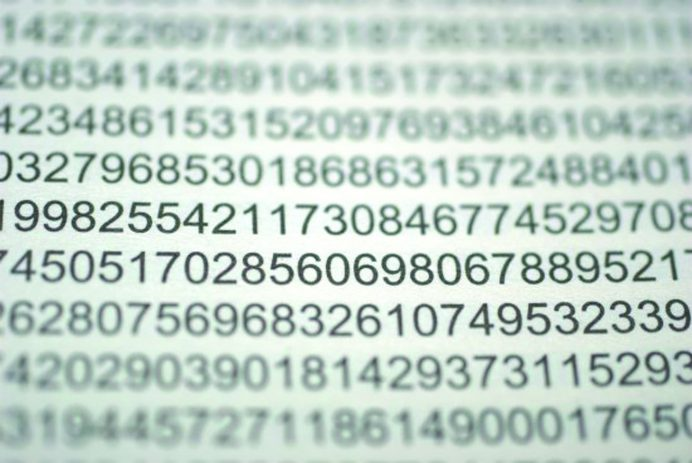

# Decimal

**The project is a native implementation of the '__int128' or 'Decimal' data type from the c# language.**

The Decimal data type provides the largest number of significant digits for a number. It supports up to 29 significant digits and can represent values greater than 7.9228 x 10^28. It is especially suitable for calculations, such as financial calculations, that require a large number of digits, but does not allow rounding errors.

* The program developed according to the principles of structured programming
* Implemented as a static library
* The defined type support numbers from -79,228,162,514,264,337,593,543,950,335 to +79,228,162,514,264,337,593,543,950,335
* The library includes arithmetic operators such as:
  + Addition - `s21_decimal s21_add(s21_decimal, s21_decimal)`
  + Subtraction - `s21_decimal s21_sub(s21_decimal, s21_decimal)`
  + Multiplication - `s21_decimal s21_mul(s21_decimal, s21_decimal)`
  + Division - `s21_decimal s21_div(s21_decimal, s21_decimal)`
  + Modulo - `s21_decimal s21_mod(s21_decimal, s21_decimal)`
* The library includes comparison operators such as:
  + Less than - `int s21_is_less(s21_decimal, s21_decimal)`
  + Less than or equal to - `int s21_is_less_or_equal(s21_decimal, s21_decimal)`
  + Greater than - `int s21_is_greater(s21_decimal, s21_decimal)`
  + Greater than or equal to - `int s21_is_greater_or_equal(s21_decimal, s21_decimal)`
  + Equal to - `int s21_is_equal(s21_decimal, s21_decimal)`
  + Not equal to - `int s21_is_not_equal(s21_decimal, s21_decimal)`
* The library includes conversion functions such as:
  + From int - `int s21_from_int_to_decimal(int src, s21_decimal *dst)`
  + From float - `int s21_from_float_to_decimal(float src, s21_decimal *dst)`
  + To int - `int s21_from_decimal_to_int(s21_decimal src, int *dst)`
  + To float - `int s21_from_decimal_to_float(s21_decimal src, float *dst)`
* And another functions:
  + Rounds a specified Decimal number to the closest integer toward negative infinity - `s21_decimal s21_floor(s21_decimal)`
  + Rounds a decimal value to the nearest integer - `s21_decimal s21_round(s21_decimal)`
  + Returns the integral digits of the specified Decimal; any fractional digits are discarded, including trailing zeroes - `s21_decimal s21_truncate(s21_decimal)`
  + Returns the result of multiplying the specified Decimal value by negative one - `s21_decimal s21_negate(s21_decimal)`
  
***

This project was developed by a students of School 21: tszechwa, larwyn, bclarent, estaedmo
